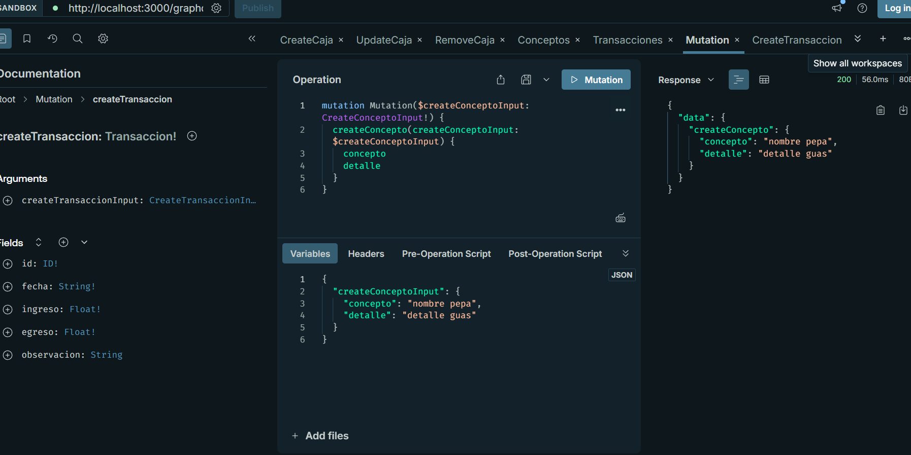

# Evidencia de imágenes en Apollo

A continuación se presentan las evidencias de las pruebas realizadas con las mutaciones y consultas en Apollo.

## Mutaciones

1. Crear una caja:
   

2. Actualizar una caja:
   

3. Eliminar una caja:
   

4. Crear una transacción:
   

5. Crear un concepto:
   

## Consultas

1. Obtener cajas:
   

2. Obtener conceptos:
   

3. Obtener transacciones:
   

Mi proyecto tiene tres módulos principales: caja, concepto y transacción, cada uno con su propia lógica organizada en servicios, resolvers y módulos. Estoy usando GraphQL para manejar consultas y mutaciones, las cuales están definidas en el archivo schema.gql.