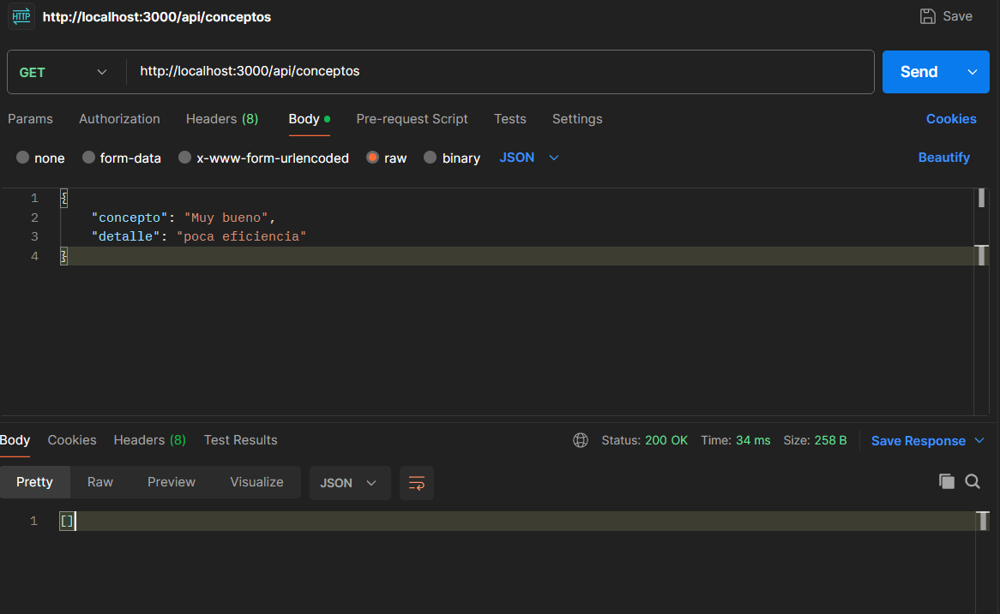
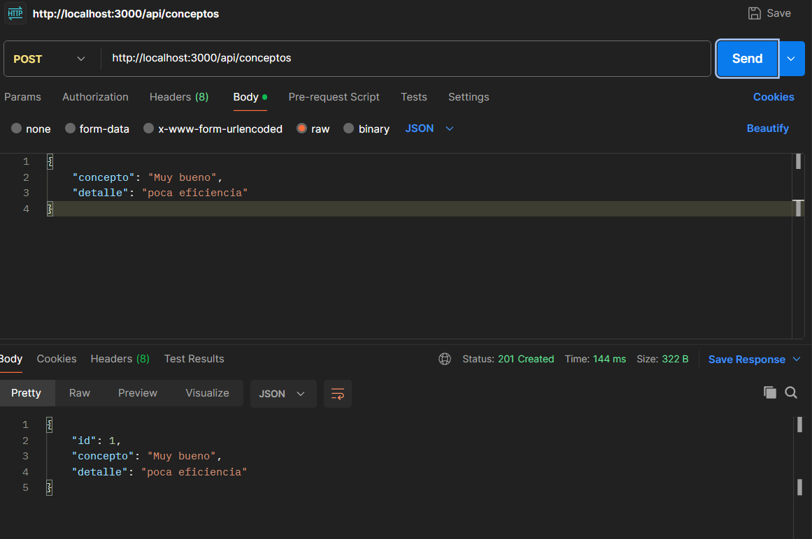
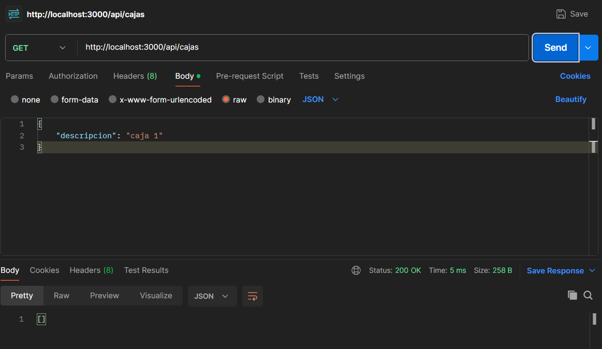
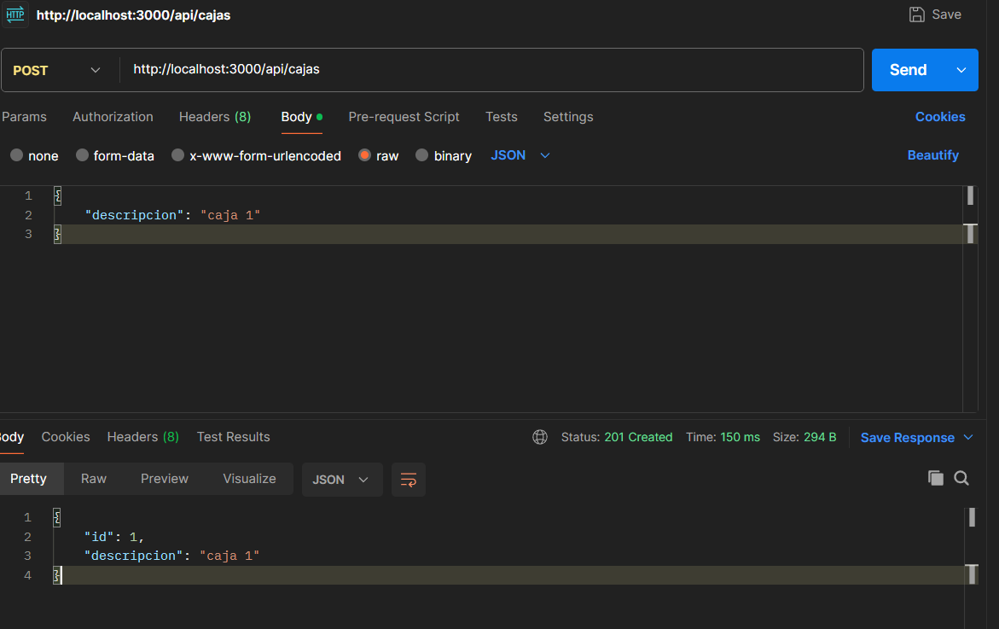
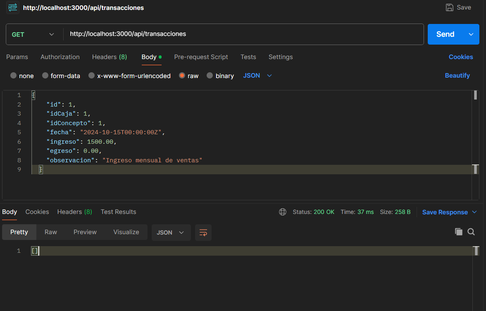
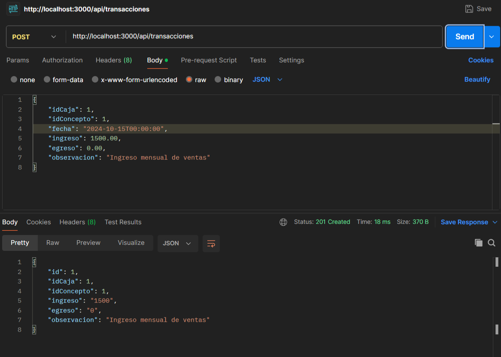

# Evidencia de Pruebas Utilizando Postman con Métodos GET y POST

El proyecto utiliza **Sequelize** como ORM para la gestión de la base de datos.

## 1. Lista de Conceptos (GET)
A continuación se muestra la respuesta del endpoint que lista todos los conceptos en la base de datos. Esta prueba se realizó utilizando el método GET.

## 2. Creación de Conceptos (POST)
En esta imagen se presenta la solicitud para crear un nuevo concepto. Se utilizó el método POST para añadir información a la base de datos.

## 3. Lista de Personas (GET)
Aquí se puede observar la respuesta del endpoint que devuelve una lista de todas las personas registradas. Esta operación se realizó utilizando el método GET.

## 4. Creación de Encuestas (POST)
En esta captura, se muestra el proceso de creación de una nueva encuesta a través del método POST. Esto permite añadir encuestas a la base de datos.

## 5. Lista de Transacciones (GET)
A continuación se presenta la respuesta del endpoint que lista todas las transacciones realizadas. Esta prueba se llevó a cabo con el método GET.

## 6. Creación de Transacciones (POST)
Finalmente, en esta imagen se observa la solicitud para crear una nueva transacción, utilizando el método POST para registrar la información.

